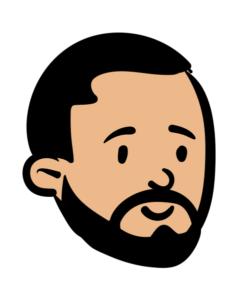

 

  

  <h3 align="center">Portfolio</h3>

  

    <a href="https://shobhit.dev">Live View</a>
    .
    <a href="https://github1s.com/shobhit-sirohi/Portfolio">Code</a>
    ·
    <a href="https://github.com/shobhit-sirohi/Portfolio/issues">Report Bug</a>
  

## Overview

My Personal Portfolio, made with minimalism in mind. Responsive For a wide range of screens.

### Built With

- [React.js](https://reactjs.org/)
- [TailwindCSS](https://tailwindcss.com/)

## Contact

Twitter - [@ShobhitSirohi](https://twitter.com/ShobhitSirohi)

## Acknowledgments

Resources I used in this project that I would like to give credit to.

- [open-peeps](https://www.openpeeps.com/)
- [Google Fonts](https://fonts.google.com/)
- [React Icons](https://react-icons.github.io/react-icons/search)
